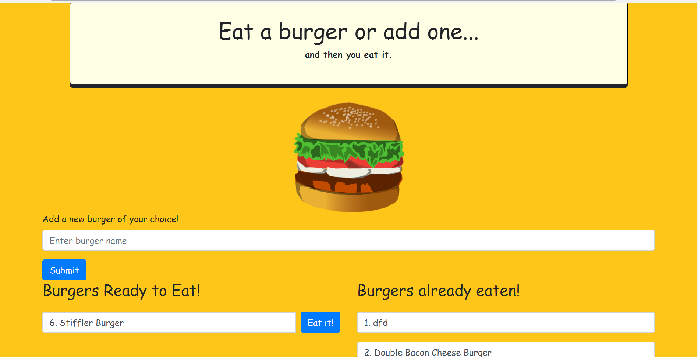

# Burger App
Eat-Da-Burger is restaurant application that lets users input the names of burgers they'd like to eat. Check out the live site here at: https://josha5-burger-app.herokuapp.com/index 

## Description & Functionality
This is a full stack application using Node, Express, HandleBars, and MySQL.

    * MySQL is being used to store and query burger information from the database and users are also able to add their own burgers which are stored in the database as well.

    * This application has 3 basic CRUD functionality where you can READ all entries from the database, Update a selected burger by clicking the eat me button, and create a new burger. 

